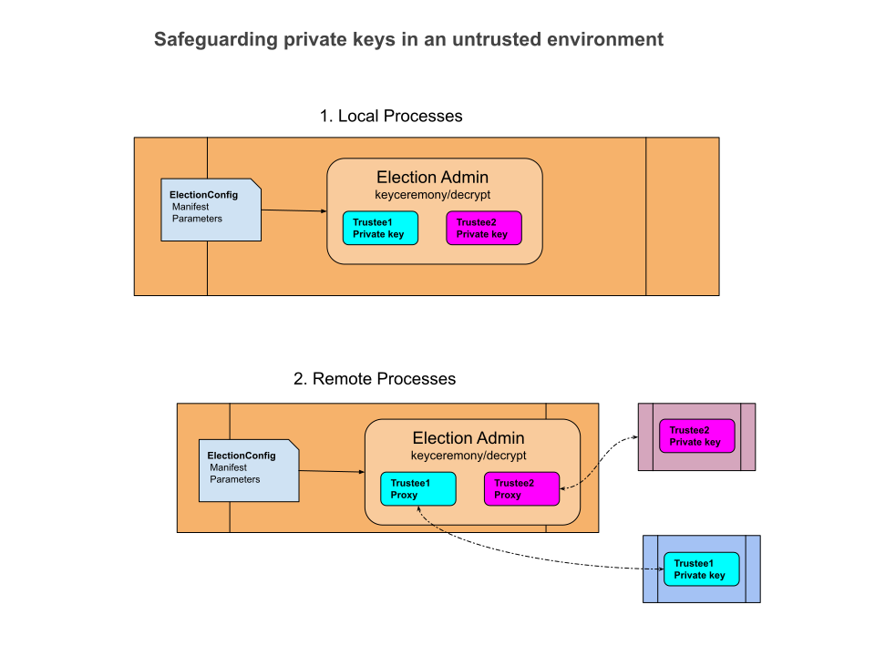

# ElectionGuard-Kotlin-Multiplatform Webapps

_last update 9/10/2023_

[ElectionGuard-Kotlin-Multiplatform (EKM)](https://github.com/danwallach/electionguard-kotlin-multiplatform) 
is a multiplatform Kotlin implementation of 
[ElectionGuard](https://github.com/microsoft/electionguard), version 2.0.0, available under an MIT-style open source 
[License](LICENSE). 

This repo contains web applications built on top of that library.

Currently Java 17 is required.

**Table of Contents**
<!-- TOC -->
* [ElectionGuard-Kotlin-Multiplatform Webapps](#electionguard-kotlin-multiplatform-webapps)
  * [Build the Egklib fat jar](#build-the-egklib-fat-jar)
  * [Build the Webapps fat jars](#build-the-webapps-fat-jars)
  * [Remote Workflow](#remote-workflow)
  * [Remote KeyCeremony](#remote-keyceremony)
    * [The keyceremonytrustee program](#the-keyceremonytrustee-program)
    * [The keyceremony program](#the-keyceremony-program)
  * [Remote Decryption](#remote-decryption)
    * [The decryptingtrustee program](#the-decryptingtrustee-program)
    * [The decryption program](#the-decryption-program)
  * [Remote Encryption](#remote-encryption)
    * [Encryption Server](#encryption-server)
    * [Encryption Client](#encryption-client)
  * [Using SSL](#using-ssl)
    * [Make KeyStore](#make-keystore)
<!-- TOC -->

## Build the Egklib fat jar

**Fat Jars** include the library and all of its dependencies, and simplify the classpath.

1. Place latest egklib-jvm-2.0.0-SNAPSHOT.jar into the **libs/** directory in this repo (if needed).
2. Execute _./gradlew fatJar_ to create the egklib fat jar at **egklib/build/libs/egklib-all.jar**.
3. Use the fat jar into egklib/build/libs/ of the library repo, and use that repo as your working directory for its
   [Command Line Programs](https://github.com/votingworks/electionguard-kotlin-multiplatform/blob/main/docs/CommandLineInterface.md)

## Build the Webapps fat jars

1. Build all the webapps fat jars: _./gradlew clean assemble_
2. Fat jars for the webapps are now in their respective build/libs directories:
   1. **encryptserver/build/libs/encryptserver-all.jar**
   2. **encryptclient/build/libs/encryptclient-all.jar**
   3. **keyceremony/build/libs/keyceremony-all.jar**
   4. **keyceremonytrustee/build/libs/keyceremonytrustee-all.jar**   
   5. **decryption/build/libs/decryption-all.jar**
   6. **decryptingtrustee/build/libs/decryptingtrustee-all.jar**

## Remote Workflow

Here is a general diagram for the ElectionGuard workflow:


For additional security, in a real election we might want to make sure that each trustee is the only one with access 
to its own **_secret key_**, by having each trustee run their own program on their own personal computer, and store 
their secret key on their own computer. In this way, neither the election administrator nor any of the other trustees 
has any kind of access to the secret key. 

Heres a diagram of the general way that works, where the separate boxes represent separate processes on separate 
computers. The processes communicate remotely, so this is called a **_Remote Workflow_**:



This remote workflow is only needed for the Key Ceremony and the Decryption stages of the workflow, because thats the
only time the secret keys are written (Key Ceremony) or read (Decryption).

The examples below assume that you are in the top directory of the egk-webapps repo, to make the classpath easier to use.
In production, you may use any working directory and adjust the paths accordingly.

## Remote KeyCeremony

The election administrator runs the **keyceremony** program, which orchestrates the 
_Key Ceremony_ where the secret keys and the _joint election keys_ are generated.
Each trustee runs a seperate
**keyceremonytrustee** _process_ that starts up first and then waits for the keyceremony to send it
requests. When the Key Ceremony is done, each keyceremonytrustee writes its own secret key to wherever the
human trustee has configured. This secret key is then used later, when the trustees come together to decrypt the
election record.

You must first generate the _Manifest_ and _Election Configuration_ files, as detailed in
[Create an Election Configuration](https://github.com/votingworks/electionguard-kotlin-multiplatform/blob/main/docs/CommandLineInterface.md#create-an-election-configuration).
The output of that process give you both the **trusteeDir** for the keyceremonytrustee, and the **inputDir** for the
keyceremony.

### The keyceremonytrustee program

_(For debugging purposes, currently all the trustees are handled by a single KeyCeremonyRemoteTrustee server. We will
soon add the "each trustee in its own process" production workflow)_

````
Value for option --trustees should be always provided in command line.
Usage: RunKeyCeremonyTrustee options_list
Options: 
    --trustees, -trusteeDir -> Directory to write output trustee record (must be private)) (always required) { String }
    --serverPort, -port -> listen on this port, default = 11183 { Int }
    --sslKeyStore, -keystore -> file path of the keystore file { String }
    --keystorePassword, -kpwd -> password for the entire keystore { String }
    --electionguardPassword, -epwd -> password for the electionguard entry { String }
    --help, -h -> Usage info 
````

To use SSL, see [Using SSL](#using-ssl)

Example:

````
/usr/lib/jvm/jdk-19/bin/java \
  -classpath keyceremonytrustee/build/libs/keyceremonytrustee-all.jar \
  electionguard.webapps.keyceremonytrustee.RunKeyCeremonyTrusteeKt \
  -trusteeDir testOut/remoteWorkflow/keyceremony/trustees 
````

You should see something like:

````
KeyCeremonyRemoteTrustee
    isSsl = false
    serverPort = '11183'
    trusteeDir = 'testOut/remoteWorkflow/keyceremony'
KeyCeremonyRemoteTrustee server ready...
````

### The keyceremony program

Start up the keyceremonytrustee program first. Then:

````
Usage: RunRemoteKeyCeremony options_list
Options: 
    --inputDir, -in -> Directory containing input ElectionConfig record { String }
    --outputDir, -out -> Directory to write output ElectionInitialized record (always required) { String }
    --remoteUrl, -remoteUrl [http://localhost:11183/egk] -> URL of keyceremony trustee webapp  { String }
    --sslKeyStore, -keystore -> file path of the keystore file { String }
    --keystorePassword, -kpwd -> password for the entire keystore { String }
    --electionguardPassword, -epwd -> password for the electionguard entry { String }
    --createdBy, -createdBy -> who created for ElectionInitialized metadata { String }
    --help, -h -> Usage info 
````

To use SSL, see [Using SSL](#using-ssl)

Example:

````
/usr/lib/jvm/jdk-19/bin/java \
  -classpath keyceremony/build/libs/keyceremony-all.jar \
  electionguard.webapps.keyceremony.RunRemoteKeyCeremonyKt \
  --inputDir /home/stormy/dev/github/electionguard-kotlin-multiplatform/testOut/cliWorkflow/electionRecord \
  --outputDir testOut/remoteWorkflow/keyceremony 
````

You should see something like:

````
RunRemoteKeyCeremony
inputDir = '/home/stormy/dev/github/electionguard-kotlin-multiplatform/testOut/cliWorkflow/config'
outputDir = 'testOut/remoteWorkflow/keyceremony'
isSsl = false

response.status for trustee1 = 201 Created
response.status for trustee2 = 201 Created
response.status for trustee3 = 201 Created
trustee2 receivePublicKeys for trustee1 = 200 OK
trustee3 receivePublicKeys for trustee1 = 200 OK
trustee1 receivePublicKeys for trustee2 = 200 OK
trustee3 receivePublicKeys for trustee2 = 200 OK
trustee1 receivePublicKeys for trustee3 = 200 OK
trustee2 receivePublicKeys for trustee3 = 200 OK
trustee1 encryptedKeyShareFor trustee2 = 200 OK
trustee2 receiveEncryptedKeyShare from trustee1 = 200 OK
trustee1 encryptedKeyShareFor trustee3 = 200 OK
trustee3 receiveEncryptedKeyShare from trustee1 = 200 OK
trustee2 encryptedKeyShareFor trustee1 = 200 OK
trustee1 receiveEncryptedKeyShare from trustee2 = 200 OK
trustee2 encryptedKeyShareFor trustee3 = 200 OK
trustee3 receiveEncryptedKeyShare from trustee2 = 200 OK
trustee3 encryptedKeyShareFor trustee1 = 200 OK
trustee1 receiveEncryptedKeyShare from trustee3 = 200 OK
trustee3 encryptedKeyShareFor trustee2 = 200 OK
trustee2 receiveEncryptedKeyShare from trustee3 = 200 OK
trustee1 saveState from = 200 OK
trustee2 saveState from = 200 OK
trustee3 saveState from = 200 OK
RunTrustedKeyCeremony took 17260 millisecs
````

You can check that the Election Configuration file was written to the outputDir. 


## Remote Decryption

The election administrator runs the **decryption** program, which orchestrates the
_Decryption_ workflow where the encrypted tally and (optionally) the challenged ballots are decrypted.
Each trustee runs a seperate
**decryptingtrustee** _process_ that starts up first and then waits for the decryption program to send it
requests. When the Decryption is done, the decrypted (aka plaintext) tally and ballots are written to the 
election record.

### The decryptingtrustee program

_(For debugging purposes, currently all the trustees are handled by a single KeyCeremonyRemoteTrustee server. We will
soon add the "each trustee in its own process" production workflow)_

````
Usage: RunDecryptingTrustee options_list
Options: 
    --trustees, -trusteeDir -> trustee output directory (always required) { String }
    --serverPort, -port [11190] -> listen on this port, default = 11190 { Int }
    --sslKeyStore, -keystore -> file path of the keystore file { String }
    --keystorePassword, -kpwd -> password for the entire keystore { String }
    --electionguardPassword, -epwd -> password for the electionguard entry { String }
    --help, -h -> Usage info 
````

To use SSL, see [Using SSL](#using-ssl)

Example:

````
/usr/lib/jvm/jdk-19/bin/java \
  -classpath decryptingtrustee/build/libs/decryptingtrustee-all.jar \
  electionguard.webapps.decryptingtrustee.RunDecryptingTrusteeKt \
  -trusteeDir /home/stormy/dev/github/electionguard-kotlin-multiplatform/egklib/src/commonTest/data/workflow/allAvailableJson/private_data/trustees 
````

You should see something like:

````
RunDecryptingTrustee
  isSsl = false
  serverPort = '11190'
  trusteeDir = '/home/stormy/dev/github/electionguard-kotlin-multiplatform/egklib/src/commonTest/data/workflow/allAvailableJson/private_data/trustees'
 
RunDecryptingTrustee server (no SSL) ready...
2023-09-10 15:11:16.841 INFO  Autoreload is disabled because the development mode is off.
2023-09-10 15:11:17.201 INFO  Application started in 0.389 seconds.
2023-09-10 15:11:17.202 INFO  Application started: io.ktor.server.application.Application@677dbd89
2023-09-10 15:11:17.347 INFO  Responding at http://localhost:11190

````

### The decryption program

Start up the decryptingtrustee program first. Then:

````
Usage: RunRemoteDecryption options_list
Options: 
    --inputDir, -in -> Directory containing input election record (always required) { String }
    --outputDir, -out -> Directory to write output election record (always required) { String }
    --remoteUrl, -remoteUrl [http://localhost:11190/egk] -> URL of decrypting trustee app  { String }
    --createdBy, -createdBy -> who created { String }
    --missing, -missing -> missing guardians' xcoord, comma separated, eg '2,4' { String }
    --help, -h -> Usage info 
````

To use SSL, see [Using SSL](#using-ssl)

Example:

````
/usr/lib/jvm/jdk-19/bin/java \
  -classpath decryption/build/libs/decryption-all.jar \
  electionguard.webapps.decryption.RunRemoteDecryptionKt \
  --inputDir /home/stormy/dev/github/electionguard-kotlin-multiplatform/egklib/src/commonTest/data/workflow/allAvailableJson \
  --outputDir testOut/remoteWorkflow/RunRemoteDecryption
````

You should see something like this from decryption :

````
RunRemoteDecryption starting
   input= /home/stormy/dev/github/electionguard-kotlin-multiplatform/egklib/src/commonTest/data/workflow/allAvailableJson
   missing= 'null'
   output = testOut/remoteWorkflow/RunRemoteDecryption
runRemoteDecrypt present = [guardian1, guardian2, guardian3] missing = []
runRemoteDecrypt reset 200 OK
DecryptingTrusteeProxy create OK
DecryptingTrusteeProxy create OK
DecryptingTrusteeProxy create OK
DecryptingTrusteeProxy challenge guardian1 = 200 OK
DecryptingTrusteeProxy challenge guardian2 = 200 OK
DecryptingTrusteeProxy challenge guardian3 = 200 OK
runRemoteDecrypt took 9606 millisecs
success = true
````

You should see something like this from decryptingtrustee :

````
2023-09-10 15:15:08.297 INFO  Status: 200 OK, HTTP method: POST, Path: /egk/dtrustee/reset
RemoteDecryptingTrustee guardian1 created
2023-09-10 15:15:11.072 INFO  Status: 200 OK, HTTP method: GET, Path: /egk/dtrustee/create/guardian1
RemoteDecryptingTrustee guardian2 created
2023-09-10 15:15:11.126 INFO  Status: 200 OK, HTTP method: GET, Path: /egk/dtrustee/create/guardian2
RemoteDecryptingTrustee guardian3 created
2023-09-10 15:15:11.138 INFO  Status: 200 OK, HTTP method: GET, Path: /egk/dtrustee/create/guardian3
RemoteDecryptingTrustee guardian1 decrypt
2023-09-10 15:15:11.820 INFO  Status: 200 OK, HTTP method: POST, Path: /egk/dtrustee/1/decrypt
RemoteDecryptingTrustee guardian2 decrypt
2023-09-10 15:15:12.542 INFO  Status: 200 OK, HTTP method: POST, Path: /egk/dtrustee/2/decrypt
RemoteDecryptingTrustee guardian3 decrypt
2023-09-10 15:15:13.168 INFO  Status: 200 OK, HTTP method: POST, Path: /egk/dtrustee/3/decrypt
RemoteDecryptingTrustee guardian1 challenge
2023-09-10 15:15:13.770 INFO  Status: 200 OK, HTTP method: POST, Path: /egk/dtrustee/1/challenge
RemoteDecryptingTrustee guardian2 challenge
2023-09-10 15:15:13.793 INFO  Status: 200 OK, HTTP method: POST, Path: /egk/dtrustee/2/challenge
RemoteDecryptingTrustee guardian3 challenge
2023-09-10 15:15:13.809 INFO  Status: 200 OK, HTTP method: POST, Path: /egk/dtrustee/3/challenge
````

You can check that the Decrypted tally file was written to the outputDir.


## Remote Encryption

The Encryption server allows you to run ballot encryption on a
different machine than where ballots are generated, and/or to call from a non-JVM program.

### Encryption Server

Its purpose is to provide ballot encryption to remote clients, or to non-JVM programs.
It uses JetBrain's [ktor web framework](https://ktor.io/).

````
Usage: RunEgkServerKt options_list
Options: 
    --inputDir, -in -> Directory containing input election record (always required) { String }
    --outputDir, -out -> Directory containing output election record (always required) { String }
    --sslKeyStore, -keystore -> file path of the keystore file { String }
    --keystorePassword, -kpwd -> password for the entire keystore { String }
    --electionguardPassword, -epwd -> password for the electionguard entry { String }
    --serverPort, -port -> listen on this port, default = 11111 { Int }
    --help, -h -> Usage info 
````

To use SSL, see [Using SSL](#using-ssl)

Example:

````
/usr/lib/jvm/jdk-19/bin/java \
  -classpath encryptserver/build/libs/encryptserver-all.jar \
  electionguard.webapps.server.RunEgkServerKt \
  --inputDir testInput/unchained \
  --outputDir testOut/encrypt/RunEgkServer
````

### Encryption Client

The Encryption client is for integration testing of the Encryption Server, and as an example of how to use the server.

Start up the Encryption Server as above before running.

````
Usage: RunEgkClientKt options_list
Options: 
    --inputDir, -in -> Directory containing input election record, for generating test ballots (always required) { String }
    --device, -device [testDevice] -> Device name { String }
    --serverUrl, -server [http://localhost:11111/egk] -> Server URL { String }
    --outputDir, -out -> Directory containing output election record, optional for validating { String }
    --nballots, -nballots [11] -> Number of test ballots to send to server { Int }
    --sslKeyStore, -keystore -> file path of the keystore file { String }
    --keystorePassword, -kpwd -> password for the entire keystore { String }
    --electionguardPassword, -epwd -> password for the electionguard entry { String }
    --help, -h -> Usage info 
````

To use SSL, see [Using SSL](#using-ssl)

Example:

````
/usr/lib/jvm/jdk-19/bin/java \
  -classpath encryptclient/build/libs/encryptclient-all.jar \
  electionguard.webapps.client.RunEgkClientKt \
  --inputDir testInput/unchained \
  --outputDir testOut/encrypt/RunEgkServer
````


## Using SSL

_(SSL is not yet implemented)_

### Make KeyStore

To use HTTPS between remote processes, we need a digital certificate. You may supply your own keystore, or use the
**_MakeKeystore_** CLI (in keyceremonytrustee module).
This will generate a self-signed certificate and write it to a JKS keystore, to be used in the webapps.
The certificate _alias_ = "electionguard" and _domains_ = listOf("127.0.0.1", "0.0.0.0", "localhost").

````
Usage: MakeKeyStore options_list
Options: 
    --keystorePassword, -kpwd -> password for the entire keystore (always required) { String }
    --electionguardPassword, -epwd -> password for the electionguard certificate entry (always required) { String }
    --sslKeyStore, -keystore -> write the keystore file to this path, default webapps/keystore.jks { String }
    --help, -h -> Usage info 
````

Example

````
/usr/lib/jvm/jdk-19/bin/java \
  -classpath keyceremonytrustee/build/libs/keyceremonytrustee-all.jar \
  electionguard.webapps.keystore.MakeKeyStoreKt \
  --inputDir testInput/unchained \
  --outputDir testOut/encrypt/RunEgkServer
````

output:

````
MakeKeyStore
 keystorePassword = 'ksPassword' electionguardPassword = 'egPassword'
 write to path = 'webapps/keystore.jks'
````
