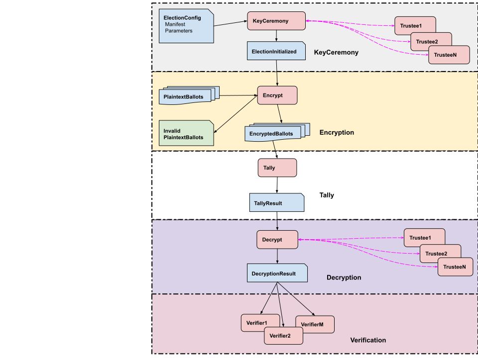

# ElectionGuard-Kotlin-Multiplatform Webapps

_last update 10/21/2023_

[ElectionGuard-Kotlin-Multiplatform (EKM)](https://github.com/danwallach/electionguard-kotlin-multiplatform) 
is a multiplatform Kotlin implementation of 
[ElectionGuard](https://github.com/microsoft/electionguard), version 2.0.0, available under an MIT-style open source 
[License](LICENSE). 

This repo contains web applications built on top of that library,
using JetBrain's [ktor web framework](https://ktor.io/).

Currently Java 17 is required.

**Table of Contents**
<!-- TOC -->
* [ElectionGuard-Kotlin-Multiplatform Webapps](#electionguard-kotlin-multiplatform-webapps)
  * [Build the Webapps fat jars](#build-the-webapps-fat-jars)
  * [Remote Workflow](#remote-workflow)
  * [Remote KeyCeremony](#remote-keyceremony)
    * [The keyceremonytrustee program](#the-keyceremonytrustee-program)
    * [The keyceremony program](#the-keyceremony-program)
  * [Remote Encryption](#remote-encryption)
    * [Encryption Server](#encryption-server)
    * [Encryption Client](#encryption-client)
  * [Run Accumulate Tally](#run-accumulate-tally)
  * [Remote Decryption](#remote-decryption)
    * [The decryptingtrustee program](#the-decryptingtrustee-program)
    * [The decryption program](#the-decryption-program)
  * [Run Verifier](#run-verifier)
  * [Using SSL](#using-ssl)
    * [Make KeyStore](#make-keystore)
<!-- TOC -->

## Build the Webapps fat jars

1. Build all the webapps fat jars: _./gradlew clean assemble_
2. Fat jars for the webapps are now in their respective build/libs directories:
   1. **encryptserver/build/libs/encryptserver-all.jar**
   2. **encryptclient/build/libs/encryptclient-all.jar**
   3. **keyceremony/build/libs/keyceremony-all.jar**
   4. **keyceremonytrustee/build/libs/keyceremonytrustee-all.jar**   
   5. **decryption/build/libs/decryption-all.jar**
   6. **decryptingtrustee/build/libs/decryptingtrustee-all.jar**

## Remote Workflow

Here is a general diagram for the ElectionGuard workflow:



For additional security, in a real election we might want to make sure that each trustee is the only one with access 
to its own **_secret key_**, by having each trustee run their own program on their own personal computer, and store 
their secret key on their own computer. In this way, neither the election administrator nor any of the other trustees 
has any kind of access to the secret key. 

Heres a diagram of the general way that works, where the separate boxes represent separate processes on (possibly) 
separate computers. The processes communicate remotely, so this is called a **_Remote Workflow_**:


This remote workflow is only needed for the Key Ceremony and the Decryption stages of the workflow, because thats the
only time the secret keys are written (Key Ceremony) or read (Decryption).

The examples below assume that you are in the top directory of the egk-webapps repo, to make the classpath easier to use.
In production, you may use any working directory and adjust the paths accordingly.

## Remote KeyCeremony

The election administrator runs the **keyceremony** program, which orchestrates the 
_Key Ceremony_ where the secret keys and the _joint election keys_ are generated.

Each trustee runs a **keyceremonytrustee** _process_ that starts up first and then waits for the keyceremony to send it
requests. When the Key Ceremony is done, each keyceremonytrustee writes its own secret key to wherever the
human trustee has configured. This secret key is then used later, when the trustees come together to decrypt the
election record.

You must first generate the _Manifest_ and _Election Configuration_ files, as detailed in
[Create an Election Configuration](https://github.com/votingworks/electionguard-kotlin-multiplatform/blob/main/docs/CommandLineInterface.md#create-an-election-configuration).
The output of that process give you both the **trusteeDir** for the keyceremonytrustee, and the **inputDir** for the
keyceremony.

Also see [Remote Ceremony REST API](docs/RemoteKeyCeremony.md).

### The keyceremonytrustee program

_(For debugging purposes, currently all the trustees are handled by a single KeyCeremonyRemoteTrustee server. We will
soon add the "each trustee in its own process" production workflow)_

````
Usage: RunKeyCeremonyTrustee options_list
Options: 
    --trustees, -trusteeDir -> Directory to write output trustee record (must be private)) (always required) { String }
    --serverPort, -port [11183] -> listen on this port { Int }
    --useJson, -json [true] -> serialize to Json or Protobuf 
    --sslKeyStore, -keystore [egKeystore.jks] -> file path of the keystore file { String }
    --keystorePassword, -kpwd -> password for the entire keystore { String }
    --electionguardPassword, -epwd -> password for the electionguard entry { String }
    --help, -h -> Usage info 
````

Example:

````
/usr/lib/jvm/jdk-19/bin/java \
  -classpath keyceremonytrustee/build/libs/keyceremonytrustee-all.jar \
  electionguard.webapps.keyceremonytrustee.RunKeyCeremonyTrusteeKt \
  -trusteeDir testOut/remoteWorkflow/keyceremony/trustees 
````

You should see something like:

````
KeyCeremonyRemoteTrustee
    isSsl = false
    serverPort = '11183'
    trusteeDir = 'testOut/remoteWorkflow/keyceremony'
KeyCeremonyRemoteTrustee server (no SSL) ready...
````

To use SSL (see [Using SSL](#using-ssl)):

````
/usr/lib/jvm/jdk-19/bin/java \
    -classpath keyceremonytrustee/build/libs/keyceremonytrustee-all.jar \
    electionguard.webapps.keyceremonytrustee.RunKeyCeremonyTrusteeKt \
    -trusteeDir testOut/remoteWorkflow/keyceremony/trustees \
    --keystorePassword $EG_KEYSTORE_PASSWORD \
    --electionguardPassword $ELECTIONGUARD_SSL_PASSWORD
````

### The keyceremony program

Start up the keyceremonytrustee program first. Then:

````
Usage: RunRemoteKeyCeremony options_list
Options: 
    --inputDir, -in -> Directory containing input ElectionConfig record (always required) { String }
    --outputDir, -out -> Directory to write output ElectionInitialized record (always required) { String }
    --serverHost, -trusteeHost [localhost] -> hostname of keyceremony trustee webapp  { String }
    --serverPort, -serverPort [11183] -> port of keyceremony trustee webapp  { Int }
    --createdBy, -createdBy -> who created (for ElectionInitialized metadata) { String }
    --sslKeyStore, -keystore [egKeystore.jks] -> file path of the keystore file { String }
     --electionguardPassword, -epwd -> password for the electionguard entry { String }
    --help, -h -> Usage info 
````

Example:

````
/usr/lib/jvm/jdk-19/bin/java \
  -classpath keyceremony/build/libs/keyceremony-all.jar \
  electionguard.webapps.keyceremony.RunRemoteKeyCeremonyKt \
  --inputDir /home/stormy/dev/github/electionguard-kotlin-multiplatform/egklib/src/commonTest/data/startConfigJson \
  --outputDir testOut/remoteWorkflow/keyceremony 
````

You should see something like:
 
````
RunRemoteKeyCeremony
inputDir = '/home/stormy/dev/github/electionguard-kotlin-multiplatform/testOut/cliWorkflow/config'
outputDir = 'testOut/remoteWorkflow/keyceremony'
isSsl = false

response.status for trustee1 = 201 Created
response.status for trustee2 = 201 Created
response.status for trustee3 = 201 Created
trustee2 receivePublicKeys for trustee1 = 200 OK
trustee3 receivePublicKeys for trustee1 = 200 OK
trustee1 receivePublicKeys for trustee2 = 200 OK
trustee3 receivePublicKeys for trustee2 = 200 OK
trustee1 receivePublicKeys for trustee3 = 200 OK
trustee2 receivePublicKeys for trustee3 = 200 OK
trustee1 encryptedKeyShareFor trustee2 = 200 OK
trustee2 receiveEncryptedKeyShare from trustee1 = 200 OK
trustee1 encryptedKeyShareFor trustee3 = 200 OK
trustee3 receiveEncryptedKeyShare from trustee1 = 200 OK
trustee2 encryptedKeyShareFor trustee1 = 200 OK
trustee1 receiveEncryptedKeyShare from trustee2 = 200 OK
trustee2 encryptedKeyShareFor trustee3 = 200 OK
trustee3 receiveEncryptedKeyShare from trustee2 = 200 OK
trustee3 encryptedKeyShareFor trustee1 = 200 OK
trustee1 receiveEncryptedKeyShare from trustee3 = 200 OK
trustee3 encryptedKeyShareFor trustee2 = 200 OK
trustee2 receiveEncryptedKeyShare from trustee3 = 200 OK
trustee1 saveState from = 200 OK
trustee2 saveState from = 200 OK
trustee3 saveState from = 200 OK
RunTrustedKeyCeremony took 17260 millisecs
````

You can check that the Election Configuration file was written to the outputDir. 

To use SSL (see [Using SSL](#using-ssl)):

````
/usr/lib/jvm/jdk-19/bin/java \
  -classpath keyceremony/build/libs/keyceremony-all.jar \
  electionguard.webapps.keyceremony.RunRemoteKeyCeremonyKt \
  --inputDir /home/stormy/dev/github/electionguard-kotlin-multiplatform/testOut/cliWorkflow/electionRecord \
  --outputDir testOut/remoteWorkflow/keyceremony \
  --keystorePassword $EG_KEYSTORE_PASSWORD \
  --electionguardPassword $ELECTIONGUARD_SSL_PASSWORD
````


## Remote Encryption

The Encryption server allows you to run ballot encryption on a
different machine than where ballots are generated, and/or to call from a non-JVM program.

Also see [Encryption Server REST API](docs/EncryptionServer.md).

### Encryption Server

````
Usage: RunEgkServerKt options_list
Options: 
    --inputDir, -in -> Directory containing input election record (always required) { String }
    --outputDir, -out -> Directory containing output election record (always required) { String }
    --sslKeyStore, -keystore -> file path of the keystore file { String }
    --keystorePassword, -kpwd -> password for the entire keystore { String }
    --electionguardPassword, -epwd -> password for the electionguard entry { String }
    --serverPort, -port -> listen on this port, default = 11111 { Int }
    --help, -h -> Usage info 
````

Example:

````
/usr/lib/jvm/jdk-19/bin/java \
  -classpath encryptserver/build/libs/encryptserver-all.jar \
  electionguard.webapps.server.RunEgkServerKt \
  --inputDir testOut/remoteWorkflow/keyceremony \
  --outputDir testOut/remoteWorkflow/electionRecord
````

To use SSL in encryption server (see [Using SSL](#using-ssl)):

````
/usr/lib/jvm/jdk-19/bin/java \
  -classpath encryptserver/build/libs/encryptserver-all.jar \
  electionguard.webapps.server.RunEgkServerKt \
  --inputDir testOut/remoteWorkflow/keyceremony \
  --outputDir testOut/encrypt/RunEgkServer \
  --keystorePassword $EG_KEYSTORE_PASSWORD \
  --electionguardPassword $ELECTIONGUARD_SSL_PASSWORD
````

### Encryption Client

The Encryption client is for integration testing of the Encryption Server, and as an example of how to use the server.

Start up the Encryption Server as above before running.

````
Usage: RunEgkClientKt options_list
Options: 
    --inputDir, -in -> Directory containing input election record, for generating test ballots (always required) { String }
    --device, -device [testDevice] -> Device name { String }
    --outputDir, -out -> Directory containing output election record, optional for validating (always required) { String }
    --nballots, -nballots [11] -> Number of test ballots to send to server { Int }
    --saveBallotsDir, -saveBallots -> save generated plaintext ballots in given directory { String }
    --challengeSome, -challengeSome [false] -> randomly challenge a few ballots 
    --serverHost, -trusteeHost [localhost] -> hostname of encryption server trustee webapp  { String }
    --serverPort, -serverPort [11111] -> port of encryption server webapp { Int }
    --sslKeyStore, -keystore [egKeystore.jks] -> file path of the keystore file { String }
    --keystorePassword, -kpwd -> password for the entire keystore { String }
    --electionguardPassword, -epwd -> password for the electionguard entry { String }
    --help, -h -> Usage info    
````

Example:

````
/usr/lib/jvm/jdk-19/bin/java \
  -classpath encryptclient/build/libs/encryptclient-all.jar \
  electionguard.webapps.client.RunEgkClientKt \
  --inputDir testOut/remoteWorkflow/keyceremony \
  --outputDir testOut/remoteWorkflow/electionRecord \
  --saveBallotsDir testOut/remoteWorkflow/electionRecord/secret/input
````

To use SSL in the encryption client (see [Using SSL](#using-ssl)):

````
/usr/lib/jvm/jdk-19/bin/java \
  -classpath encryptclient/build/libs/encryptclient-all.jar \
  electionguard.webapps.client.RunEgkClientKt \
  --inputDir testOut/remoteWorkflow/keyceremony \
  --outputDir testOut/remoteWorkflow/electionRecord \
  --keystorePassword $EG_KEYSTORE_PASSWORD \
  --electionguardPassword $ELECTIONGUARD_SSL_PASSWORD
````


## Run Accumulate Tally

This is not a remote process, since no secret info is needed. Included here for completeness.

````
Usage: RunAccumulateTally options_list
Options: 
    --inputDir, -in -> Directory containing input ElectionInitialized record and encrypted ballots (always required) { String }
    --outputDir, -out -> Directory to write output election record (always required) { String }
    --name, -name -> Name of tally { String }
    --createdBy, -createdBy -> who created { String }
    --help, -h -> Usage info 
````

Example:

````
/usr/lib/jvm/jdk-19/bin/java \
  -classpath libs/egklib-all.jar \
  electionguard.cli.RunAccumulateTally \
    -in testOut/remoteWorkflow/electionRecord \
    -out testOut/remoteWorkflow/electionRecord 
````


## Remote Decryption

Each trustee runs a seperate **decryptingtrustee** _process_ that starts up first and then waits for the
decryption program to send it requests. 

The election administrator runs the **decryption** program, which orchestrates the
_Decryption_ workflow where the encrypted tally and the challenged ballots are decrypted.
When the Decryption is done, the decrypted (aka plaintext) tally and ballots are written to the election record.

Also see [Remote Decryption REST API](docs/RemoteDecryption.md).

### The decryptingtrustee program

_(For debugging purposes, currently all the trustees are handled by a single KeyCeremonyRemoteTrustee server. We will
soon add the "each trustee in its own process" production workflow)_

````    
Usage: RunDecryptingTrustee options_list
Options: 
    --trustees, -trusteeDir -> trustee output directory (always required) { String }
    --trusteeIsJson, -isJson [true] -> trustees are in JSON format 
    --serverPort, -port [11190] -> listen on this port, default = 11190 { Int }
    --sslKeyStore, -keystore [egKeystore.jks] -> file path of the keystore file { String }
    --keystorePassword, -kpwd -> password for the entire keystore { String }
    --electionguardPassword, -epwd -> password for the electionguard entry in the keystore { String }
    --clientName, -client [electionguard] -> client user name { String }
    --clientPassword, -cpwd -> client user password { String }
    --help, -h -> Usage info 
````
Example:

````
/usr/lib/jvm/jdk-19/bin/java \
  -classpath decryptingtrustee/build/libs/decryptingtrustee-all.jar \
  electionguard.webapps.decryptingtrustee.RunDecryptingTrusteeKt \
  -trusteeDir testOut/remoteWorkflow/keyceremony/trustees  
````

You should see something like:

````
RunDecryptingTrustee
  isSsl = false
  serverPort = '11190'
  trusteeDir = '/home/stormy/dev/github/electionguard-kotlin-multiplatform/egklib/src/commonTest/data/workflow/allAvailableJson/private_data/trustees'
 
RunDecryptingTrustee server (no SSL) ready...
2023-09-10 15:11:16.841 INFO  Autoreload is disabled because the development mode is off.
2023-09-10 15:11:17.201 INFO  Application started in 0.389 seconds.
2023-09-10 15:11:17.202 INFO  Application started: io.ktor.server.application.Application@677dbd89
2023-09-10 15:11:17.347 INFO  Responding at http://localhost:11190

````

To use SSL in decryptingtrustee (see [Using SSL](#using-ssl)):

````
/usr/lib/jvm/jdk-19/bin/java \
  -classpath decryptingtrustee/build/libs/decryptingtrustee-all.jar \
  electionguard.webapps.decryptingtrustee.RunDecryptingTrusteeKt \
  -trusteeDir /home/stormy/dev/github/electionguard-kotlin-multiplatform/egklib/src/commonTest/data/workflow/someAvailableJson/private_data/trustees \
  -kpwd $EG_KEYSTORE_PASSWORD \
  -epwd $ELECTIONGUARD_SSL_PASSWORD \
  -client CLIENT_NAME \
  -cpwd CLIENT_PASSWORD
````

### The decryption program

Start up the decryptingtrustee program first. Then:

````
Usage: RunRemoteDecryption options_list
Options: 
    --inputDir, -in -> Directory containing input election record (always required) { String }
    --outputDir, -out -> Directory to write output election record (always required) { String }
    --serverHost, -trusteeHost [localhost] -> hostname of decrypting trustee webapp  { String }
    --serverPort, -serverPort [11190] -> port of decrypting trustee webapp  { Int }
    --createdBy, -createdBy -> who created { String }
    --missing, -missing -> missing guardians' xcoord, comma separated, eg '2,4' { String }
    --clientKeyStore, -keystore [clientkeystore.p12] -> file path of the client keystore file { String }
    --clientKeystorePassword, -ckpwd -> password for the client keystore { String }
    --clientName, -client [electionguard] -> client user name { String }
    --clientPassword, -cpwd -> client user password { String }
    --help, -h -> Usage info 
````

Example:

````
/usr/lib/jvm/jdk-19/bin/java \
  -classpath decryption/build/libs/decryption-all.jar \
  electionguard.webapps.decryption.RunRemoteDecryptionKt \
  --inputDir  testOut/remoteWorkflow/electionRecord \
  --outputDir testOut/remoteWorkflow/electionRecord
````

To use SSL in decryption (see [Using SSL](#using-ssl)):

````
/usr/lib/jvm/jdk-19/bin/java \
  -classpath decryption/build/libs/decryption-all.jar \
  electionguard.webapps.decryption.RunRemoteDecryptionKt \
  --inputDir testOut/remoteWorkflow/electionRecord \
  --outputDir testOut/remoteWorkflow/electionRecord \
  --missing 1,3 \
  -ckpwd $EG_CLIENTKEYSTORE_PASSWORD \
  -client CLIENT_NAME \
  -cpwd CLIENT_PASSWORD
````

## Run Verifier

Here for completeness

```` 
Usage: RunVerifier options_list
Options: 
    --inputDir, -in -> Directory containing input election record (always required) { String }
    --nthreads, -nthreads [11] -> Number of parallel threads to use { Int }
    --showTime, -time [false] -> Show timing 
    --help, -h -> Usage info
````

Example:

````
/usr/lib/jvm/jdk-19/bin/java \
  -classpath libs/egklib-all.jar \
  electionguard.cli.RunVerifier \
    -in testOut/remoteWorkflow/electionRecord 
````


## Using SSL

SSL is enabled by specifying both _--keystorePassword_ and _--electionguardPassword_ on the command line.
These are specified when you create the keystore, and must match those.

You must use SSL (or not) on both the server and the client. However, each server/client pair
(keyceremony, decryption, encryption) can be set independently.

### Make KeyStore

To use HTTPS between remote processes, we need a digital certificate. You may use the
[keystore tool](https://docs.oracle.com/en/java/javase/17/docs/specs/man/keytool.html)
or use the **_MakeKeystore_** CLI (in keyceremonytrustee module).

This will generate a self-signed certificate and write it to a JKS keystore, to be used in the webapps.
The certificate _alias_ = "electionguard" and _domains_ = listOf("127.0.0.1", "0.0.0.0", "localhost").

Keep the keystore file and passwords safe and private. If they are compromised, and for each election, generate new ones.

In the examples above, its is assumed that EG_KEYSTORE_PASSWORD and ELECTIONGUARD_SSL_PASSWORD are environment variables
set for example in your shell startup script. 


````
Usage: MakeKeystore options_list
Options: 
    --keystoreFile, -keystore [egKeystore.jks] -> file path of the keystore file { String }
    --keystorePassword, -kpwd -> password for the entire keystore (always required) { String }
    --electionguardPassword, -epwd -> password for the electionguard certificate entry (always required) { String }
    --domainList, -domains [127.0.0.1, 0.0.0.0, localhost] -> list of domains (comma separated) { String }
    --validDays, -daysvalid [3] -> number of days the certificate is valid { Int }
    --x500Principal, -x500 [CN=voting.works, OU=electionguard.webapps, O=votingworks, C=US] -> create X500 principle with this distinguished name { String }
    --help, -h -> Usage info 
````

Example

````
/usr/lib/jvm/jdk-19/bin/java \
  -classpath keyceremonytrustee/build/libs/keyceremonytrustee-all.jar \
  electionguard.webapps.keystore.MakeKeystoreKt \
  -kpwd $EG_KEYSTORE_PASSWORD \
  -epwd $ELECTIONGUARD_SSL_PASSWORD \
  -domains "localHost, 127.0.0.1" \
  -daysvalid 30
  
````

Check contents with keytool:

````
keytool -keystore egKeystore.jks -storepass $EG_KEYSTORE_PASSWORD -list -v
````

output:

````
Keystore type: JKS
Keystore provider: SUN

Your keystore contains 1 entry

Alias name: electionguard
Creation date: Oct 18, 2023
Entry type: PrivateKeyEntry
Certificate chain length: 1
Certificate[1]:
Owner: CN=voting.works, OU=electionguard.webapps, O=votingworks, C=US
Issuer: CN=voting.works, OU=electionguard.webapps, O=votingworks, C=US
Serial number: 40efb4e628ba6248
Valid from: Wed Oct 18 15:19:50 MDT 2023 until: Fri Nov 17 14:19:50 MST 2023
Certificate fingerprints:
	 SHA1: 79:33:21:B8:55:80:60:8F:FC:43:5E:79:7F:FD:5E:4A:6B:77:F7:D3
	 SHA256: F6:AA:DD:2A:F2:96:02:98:84:C4:40:22:87:23:DF:BF:C0:30:7C:3D:A1:7B:A5:23:23:0A:62:6A:F1:47:E4:7B
Signature algorithm name: SHA256withRSA
Subject Public Key Algorithm: 3072-bit RSA key
Version: 3

Extensions: 

#1: ObjectId: 2.5.29.37 Criticality=false
ExtendedKeyUsages [
  serverAuth
]

#2: ObjectId: 2.5.29.17 Criticality=false
SubjectAlternativeName [
  DNSName: localHost
  DNSName: 127.0.0.1
  IPAddress: 127.0.0.1
]
````

Create a truststore for the client:

````
$ keytool -keystore egKeystore.jks -alias electionguard -exportcert -file electionguard.cer
Enter keystore password:  $EG_KEYSTORE_PASSWORD
Certificate stored in file <electionguard.cer>

$ keytool -keystore clientkeystore.p12 -alias electionguard -import -file electionguard.cer
Enter keystore password:  $EG_CLIENTKEYSTORE_PASSWORD
Re-enter new password: $EG_CLIENTKEYSTORE_PASSWORD

Owner: CN=voting.works, OU=electionguard.webapps, O=votingworks, C=US
Issuer: CN=voting.works, OU=electionguard.webapps, O=votingworks, C=US
Serial number: 40efb4e628ba6248
Valid from: Wed Oct 18 15:19:50 MDT 2023 until: Fri Nov 17 14:19:50 MST 2023
Certificate fingerprints:
	 SHA1: 79:33:21:B8:55:80:60:8F:FC:43:5E:79:7F:FD:5E:4A:6B:77:F7:D3
	 SHA256: F6:AA:DD:2A:F2:96:02:98:84:C4:40:22:87:23:DF:BF:C0:30:7C:3D:A1:7B:A5:23:23:0A:62:6A:F1:47:E4:7B
Signature algorithm name: SHA256withRSA
Subject Public Key Algorithm: 3072-bit RSA key
Version: 3

Extensions: 

#1: ObjectId: 2.5.29.37 Criticality=false
ExtendedKeyUsages [
  serverAuth
]

#2: ObjectId: 2.5.29.17 Criticality=false
SubjectAlternativeName [
  DNSName: localHost
  DNSName: 127.0.0.1
  IPAddress: 127.0.0.1
]

Trust this certificate? [no]:  yes
Certificate was added to keystore

````

Check contents:

````
keytool -keystore clientkeystore.p12 -storepass $EG_CLIENTKEYSTORE_PASSWORD -list -v
````

Output look something like:

````
keytool -keystore clientkeystore.p12 -storepass crypto2 -list -v
Keystore type: PKCS12
Keystore provider: SUN

Your keystore contains 1 entry

Alias name: electionguard
Creation date: Oct 18, 2023
Entry type: trustedCertEntry

Owner: CN=voting.works, OU=electionguard.webapps, O=votingworks, C=US
Issuer: CN=voting.works, OU=electionguard.webapps, O=votingworks, C=US
Serial number: 40efb4e628ba6248
Valid from: Wed Oct 18 15:19:50 MDT 2023 until: Fri Nov 17 14:19:50 MST 2023
Certificate fingerprints:
	 SHA1: 79:33:21:B8:55:80:60:8F:FC:43:5E:79:7F:FD:5E:4A:6B:77:F7:D3
	 SHA256: F6:AA:DD:2A:F2:96:02:98:84:C4:40:22:87:23:DF:BF:C0:30:7C:3D:A1:7B:A5:23:23:0A:62:6A:F1:47:E4:7B
Signature algorithm name: SHA256withRSA
Subject Public Key Algorithm: 3072-bit RSA key
Version: 3

Extensions: 

#1: ObjectId: 2.5.29.37 Criticality=false
ExtendedKeyUsages [
  serverAuth
]

#2: ObjectId: 2.5.29.17 Criticality=false
SubjectAlternativeName [
  DNSName: localHost
  DNSName: 127.0.0.1
  IPAddress: 127.0.0.1
]
````


